A Few months back, I got to work on a stimulating project at work. While, I cannot delve into the business details
for obvious reasons, what I can delve into is the technical learning that I picked up in the process. 
The experience also took me back to my “Intro to Graphics” class from undergrad — one of my favorite courses during my 
three years of study, largely thanks to how incredible the professor was. Unsurprisingly, many of the concepts he taught 
came back to me with ease — a testament to his passion for teaching.

The task was to represent certain information graphically for the user to understand their consumption of X at a glance.
X could be anything here, but for our purpose, let us assume it is water supply in a house. Imagine a single level
Sankey Diagram represented in a (curved) star shape. Each water source or consumer is placed at the outer edge. The direction of
the flow is represented by pointed arrows and its quantity by their thickness. The color of the arrow represents hot or cold water.

The final output is the image below.

  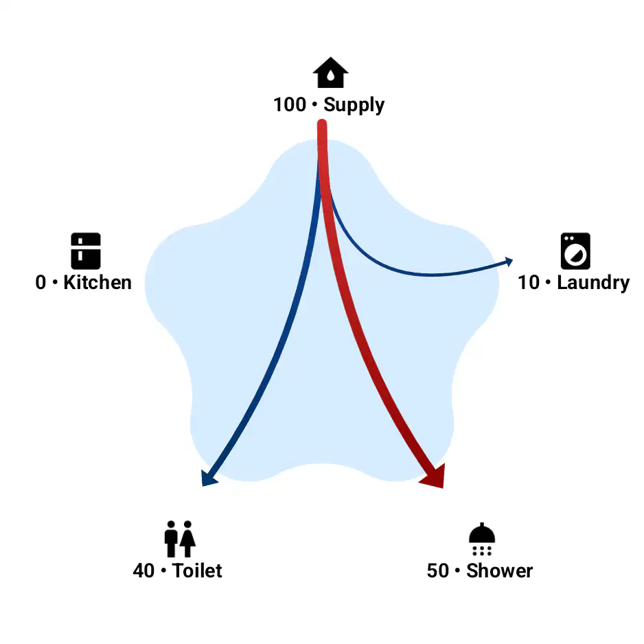

Let's dig into the implementation details now. Here is how we will move forward:

1. Introduction to our canvas
2. Defining our Data Models
3. Draw the star shape
4. Draw the icons on the outer edges of the star
5. Draw the arrows

## Introduction to our Canvas

First, let's understand our canvas on which we will be drawing all our shapes, arrows and icons.
Think of it as a graph paper used to represent a Cartesian Plane. However, unlike the high school Cartesian Plane
which we are used to, a computer's origin `(0,0)` does not lie in the center of the canvas. But in the top left corner.
This is true for all computers we encounter in our daily life. Plus, the X coordinate increases to the right,
and Y increases going down. There might be some exceptions, but we
do not have to be concerned about those. This coordinate system is called the **Display Coordinate System** while the more
typical one is called **Cartesian Coordinate System**.

As a result, the angle directions in our Display Coordinate system are also different. The 0 degrees is on the right,
90 degrees to the bottom, 180 to the left and 270 to the top. The 0 and 180 degree directions remain the same as for
both the coordinate systems, but the 90 and 270 degree directions are flipped.

  <figure style="border: 2px solid #ccc; border-radius: 12px; padding: 10px; text-align: center; display: flex; flex-direction: column; align-items: center;">
    <picture>
      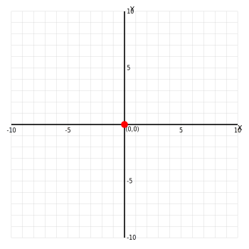
    </picture>
    <figcaption>Figure 1: Cartesian Coordinate System</figcaption>
  </figure>

  <figure style="border: 2px solid #ccc; border-radius: 12px; padding: 10px; text-align: center; display: flex; flex-direction: column; align-items: center;">
    <picture>
      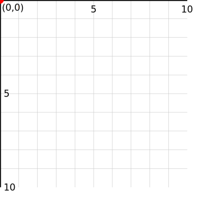
    </picture>
    <figcaption>Figure 2: Display Coordinate System</figcaption>
  </figure>

<figure style="border: 2px solid #ccc; border-radius: 12px; padding: 10px; text-align: center; display: flex; flex-direction: column; align-items: center;">
    <picture>
      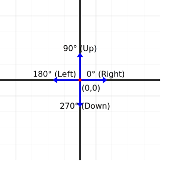
    </picture>
    <figcaption>Figure 3: Angles in CCS</figcaption>
  </figure>

  <figure style="border: 2px solid #ccc; border-radius: 12px; padding: 10px; text-align: center; display: flex; flex-direction: column; align-items: center;">
    <picture>
      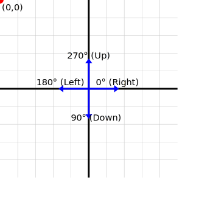
    </picture>
    <figcaption>Figure 4: Angles in DCS</figcaption>
  </figure>

The reasons for the origin being in the top left and not center are multiple,
and you can read about those [here](https://gamedev.stackexchange.com/questions/83570/why-is-the-origin-in-computer-graphics-coordinates-at-the-top-left).

## Defining our Data Models

We need the following information to draw the star, the icons on the vertices and the arrows.



data class ArrowData(
   val fromTo: Pair<Int, Int>,
   val thickness: Float = 7f,
   val colorPair: Pair<Int, Int> = 0xFF888888.toInt() to 0xFF000000.toInt(),
)



`colorPair` is for achieving a gradient effect. It can very well be a single color.



data class IconData(
   val icon: ByteArray,
   val primaryText: String,
   val secondaryText: String = "",
) { .. }



Both data classes can be passed as a list to our Compose Canvas and the `IconData` count can be a proxy for number of outer vertices of our star.

## Draw the Star Shape

We will start easy and take help of the [`graphics-shapes`](https://developer.android.com/develop/ui/compose/graphics/draw/shapes)
library which is part of Android's graphic offering. Using this library will make it easy for us to draw the curved star
while we move ahead with the basics of computer graphics. Later we will come back and try to draw the star manually.

To draw the star, we need the following values:

1. **An outer radius**: The boundary on which the outer vertices/ edges will be placed. Not to be confused with point where the icons will be placed.
2. **Inner radius**: The boundary on which the inner vertices/ edges will be placed.
3. **number of vertices per radii**: Since, in a star, the number of inner and outer vertices are equal, we can make do with this value.
   The actual number of vertices is twice this value.

We additionally need to provide some information to make our star rounded, but that too is something we will deal with later.

Let's finally draw the star now.



@Composable
private fun WaterFlowGraph(
icons: List<IconData>,
modifier: Modifier = Modifier,
arrows: List<ArrowData> = emptyList(),
sizeDp: Dp = 350.dp) {

    // We need to convert Dp to Px for for any low-level drawing operations
    val sizePx = with(LocalDensity.current) { sizeDp.toPx() }  

    val outerRadius = sizePx / 2.5f // Hit and trial makes 2.5f a good number, visually, for deciding the position of our outer vertices
    val innerRadius = outerRadius * 0.5f // Half of outer radius  

    val verticesCount = icons.size // 5 in this case

    // We use `graphics-shapes` lib to draw our star polygon 
    val starShape = remember(sizePx) {
        RoundedPolygon.star(
            numVerticesPerRadius = verticesCount,
            radius = outerRadius,
            innerRadius = innerRadius,
        )
    }

    Canvas(modifier = modifier.size(sizeDp)) {
        drawPath(
            path = starShape.toPath().asComposePath(),
            color = Color(starShapeData.primaryColor),
            style = Fill
        )
    }
}



And here is the result:

  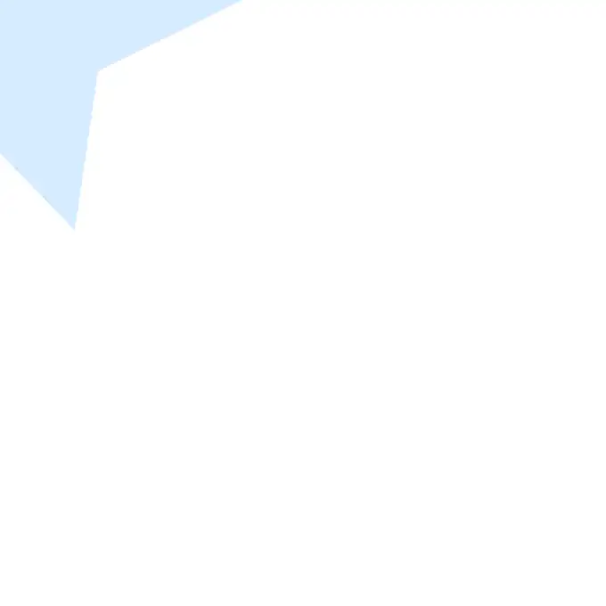

We have ourselves 1/4th of a star! It's not hard to guess why this has happened since we know from Figure 2 that our
origin (0,0) is at the top left of the screen. Which means that the center of our star is also on the top-left. 
In a display system, all the drawings are made in what will be considered **Quadrant IV** in a traditional system of the 
Cartesian plane. However, all coordinates are positive and originate from the top-left.  

The fix is simple:

1. Find the center of the canvas
2. Move the star to the said center



Canvas(modifier = modifier.size(sizeDp)) {

        val centerX = size.width / 2
        val centerY = size.height / 2

        withTransform({
            translate(centerX, centerY) // Move the star to canvas center
        }) {
            drawPath(
                path = starShape.toPath().asComposePath(),
                color = Color(starShapeData.primaryColor),
                style = Fill
            )
        }
}



Output:

   

This looks good. However, the star is a bit crooked—the top most vertice is tilted a bit towards the right.
If we experiment with the number of vertices, the crookedness remains for a majority of the cases.

  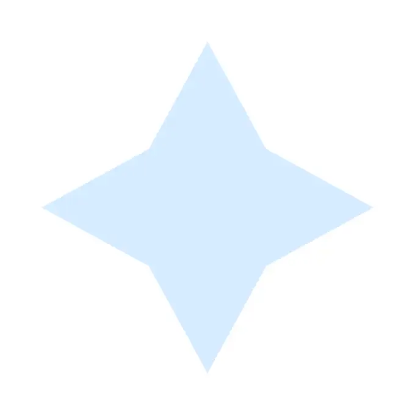
  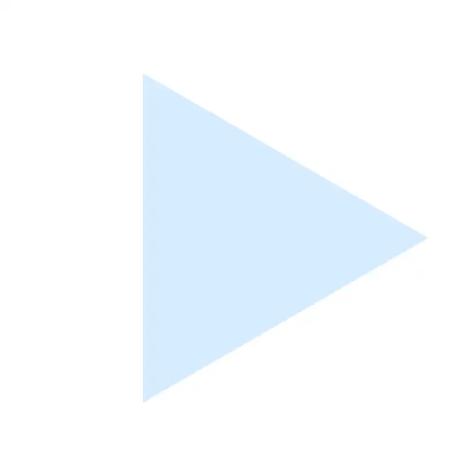
  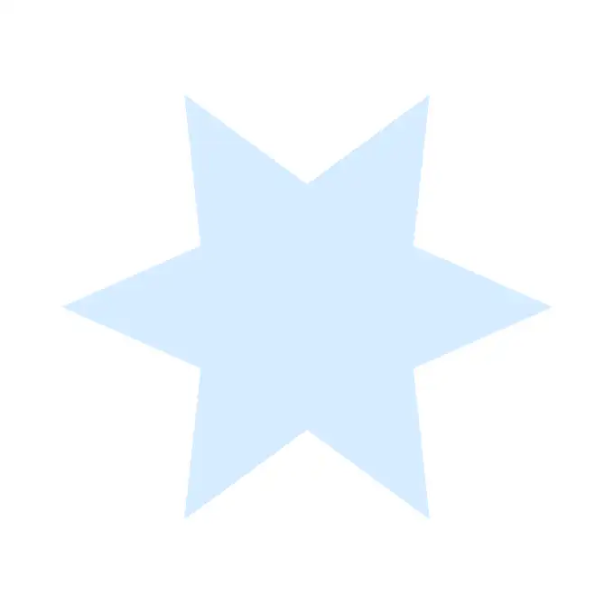

The reason for the stars being tilted can be derived from Figure 4.

If you are like me, you would assume, intuitively, that the system starts drawing from the top (12 O'clock position). 
However, that is incorrect. The system actually starts drawing from angle 0 (this is where the first vertice is positioned) 
and then progresses, clock wise, to angle 90 at the bottom and so on. 

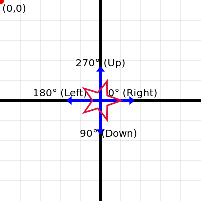

This is the reason why the right most vertice of our star is always aligned to the 3 O'clock position, 
irrespective of the number of vertices.

  

    

      With this knowledge in our mind now, the fix for the crookedness is to simply rotate the position of the 
      first vertice by -90 degrees. This will make sure that the first vertice is always in the 12 O'clock position.
    

  

  

    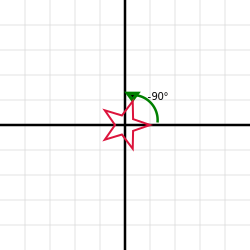
  



..

Canvas(modifier = modifier.size(sizeDp)) {

   ..

   val requiredRotation = -90f

   // Move the star to the canvas's center and apply the calculated rotation
   withTransform({
      translate(centerX, centerY)
      rotate(requiredRotation, pivot = Offset(0f, 0f))
   }) {
      drawPath(
         path = starShape.toPath().asComposePath(),
         color = Color(starShapeData.primaryColor),
         style = Fill
      )
   }
}



`pivot = Offset(0f, 0f)` here means that we want to rotate around the new origin, which is the center of the canvas. 
Do not get confused with the origin of the canvas-the actual (0,0) on the top-left.

Final Output:

  

Success!

One more thing-for clarity, here is the highlighted `innerRadius` and `outerRadius` in green and red respectively. 
This helps us visualize how the star is drawn by the `RoundedPolygon.star()` function.

   

With this, I conclude with my introduction to the computer's display system and how it draws on a screen/ canvas.

In part 2, we will draw the icons on the outer edges of the star. And finally, make the star smooth and rounded. 
