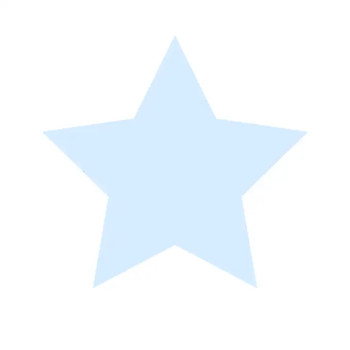
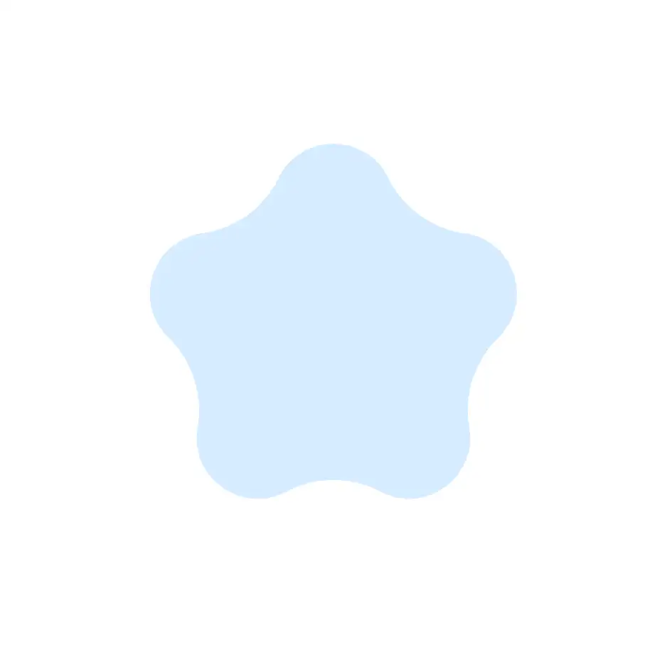
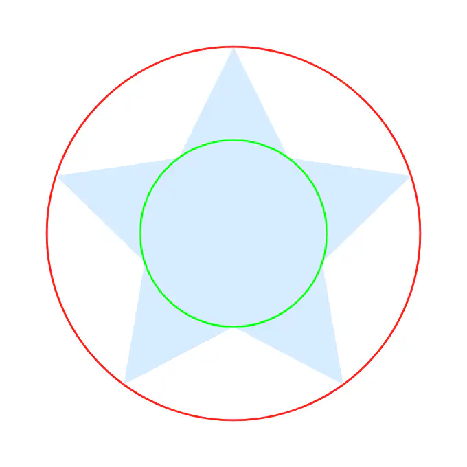
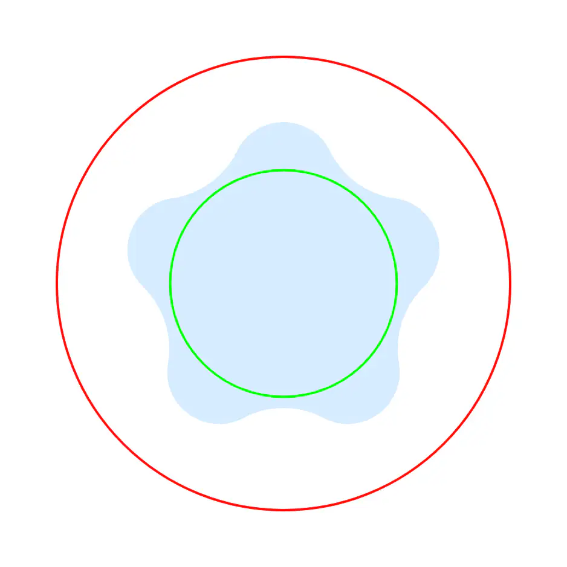
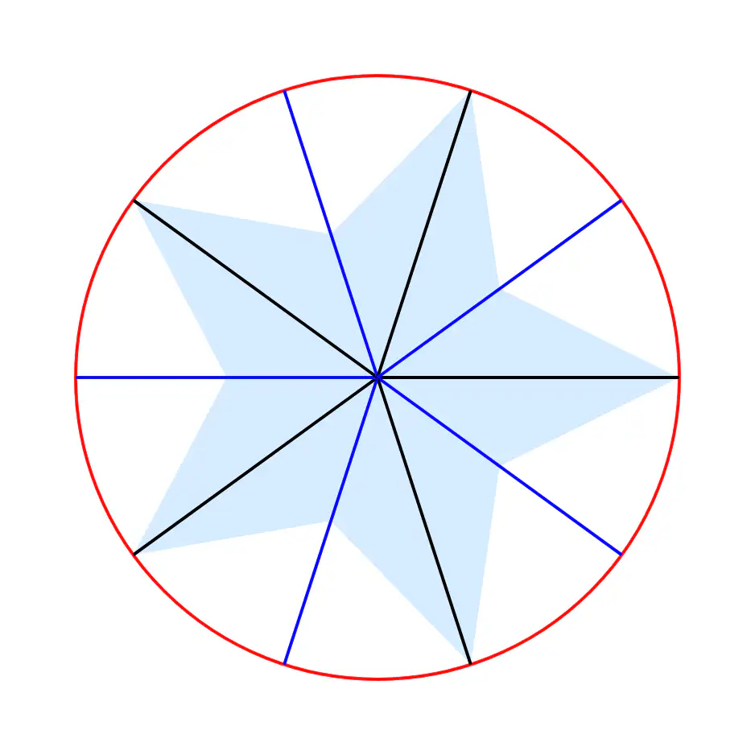
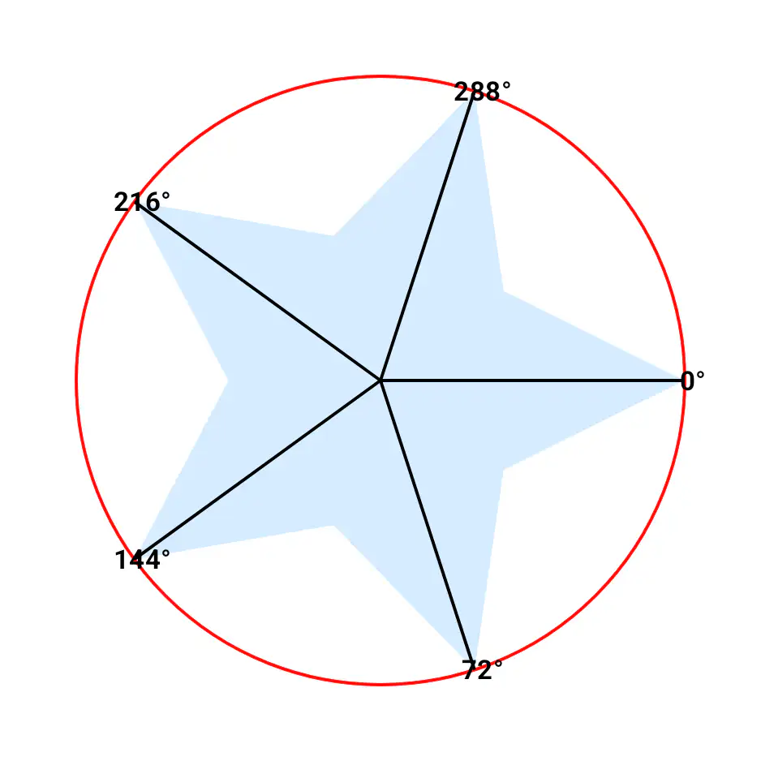
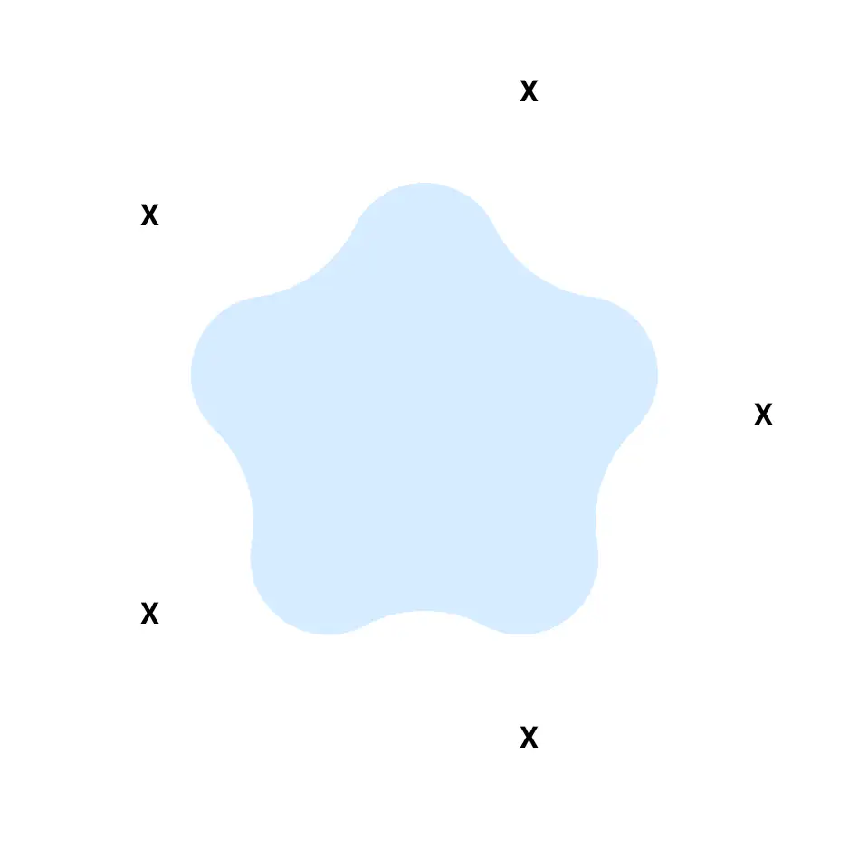
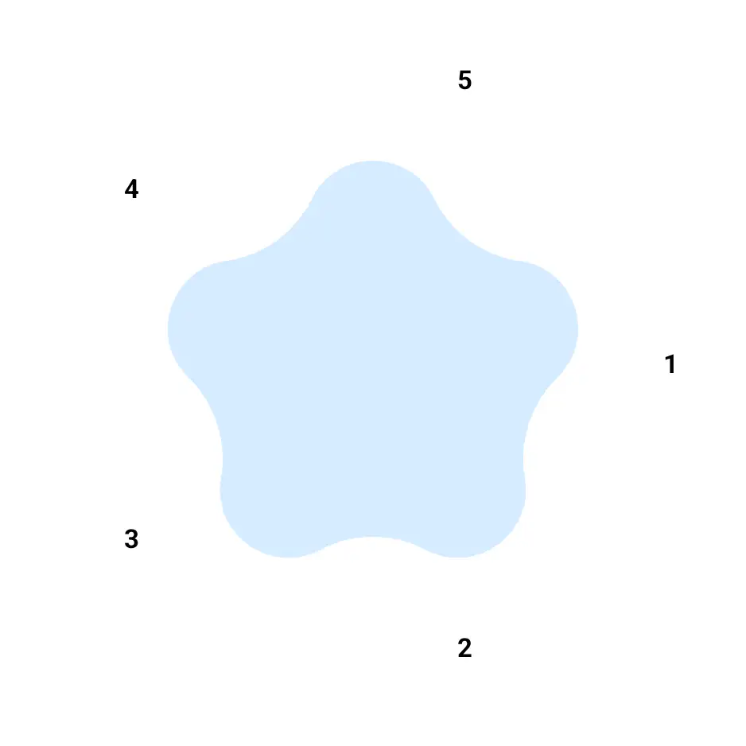
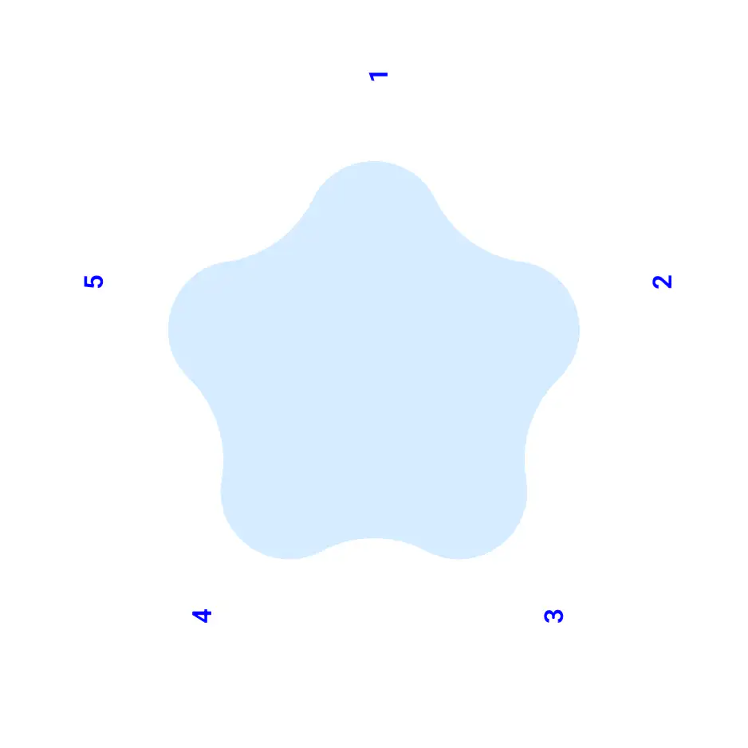
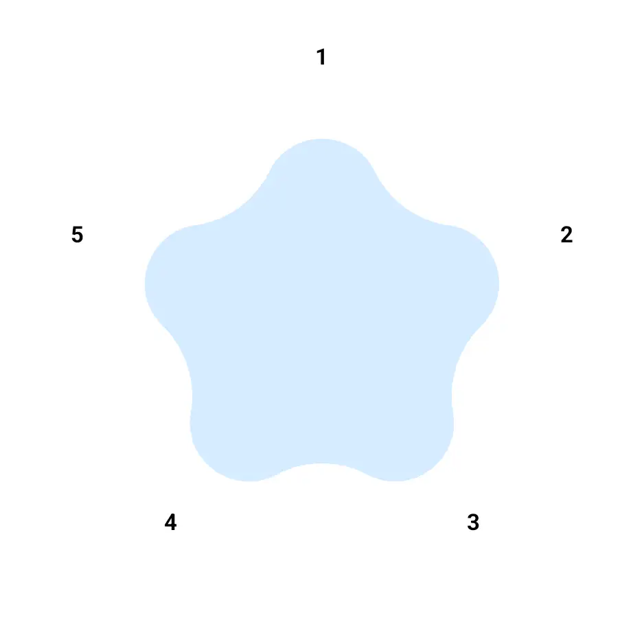

This is the second part of a series of posts titled "Exploring some basics of computer graphics with Compose Canvas."
In the [previous](https://krtkush.com/computer-graphics-basics-with-compose-part-1/) post, we successfully drew a star.

  

In this, part 2, we aim to achieve the following:

1. Make the star shape smooth and rounded
2. Draw icons 

## Smoothen and Round the Star

It is pretty trivial to smoothen and round our star shape. The `RoundedPolygon.star()` function accepts `rounding` and `innerRounding` arguments to help achieve our shape.



val starShape = remember(sizePx) {
    RoundedPolygon.star(
        numVerticesPerRadius = verticesCount,
        radius = outerRadius,
        innerRadius = innerRadius,
        rounding = CornerRounding(outerRadius * 0.3f, smoothing = 0.8f),
        innerRounding = CornerRounding(outerRadius * 0.5f)
    )
}



The hard-coded values (`0.3f`,`0.8f` and `0.5f`) are derived from hit and trial, based on the visual output.

  

Here is a visual context of our star's transformation -

  
  

## Draw icons

Drawing icons is a bit more complicated thanks to the very `graphics-shapes` library that simplified drawing the star for us.
This is because the `RoundedPolygon.star()` function does not provide the positions
of the outer (or any) vertices. And we need those positions to place our icons on. 
Hence, we will have to figure out the positions on our own. We can do that by following 
the same math as the `star()` function uses. This will help us find the same vertices the `star()` function drew.

To find the position of the vertices, we can make use of parameters that are already available to us - 

1. `verticesCount`: Number of outer vertices to calculate the angle of each vertex. 
2. `outerRadius`: This is where we draw/ place the icons. If the star size had not shrunk after its rounding and smoothing, we would need a bigger value here to prevent icons from overlapping the star's vertices.. 
3. `center`: Same value as our star's center.

Here is the function to return a list of offsets which represent the icon positions.   


private fun generatePointsForIconPlacement(
    numVerticesPerRadius: Int,
    outerRadius: Float,
    centerX: Float,
    centerY: Float,
): List<Offset> {

    val iconPositions = mutableListOf<Offset>()
    val angleStep = (Math.PI * 2) / (numVerticesPerRadius * 2)

    for (i in 0 until numVerticesPerRadius * 2) {
        val angle = i * angleStep

        if (i % 2 == 0) {
            val iconX = (centerX + cos(angle) * outerRadius).toFloat()
            val iconY = (centerY + sin(angle) * outerRadius).toFloat()

            iconPositions.add(Offset(iconX, iconY))
        }
    }

    return iconPositions
}


Let's break the function down. 


val angleStep = (Math.PI * 2) / (numVerticesPerRadius * 2)


First, we calculate `angleStep`, the angular increment between successive vertices (both inner and outer) of the star.
We know that a full circle is 2π radians and the number of vertices in a star is actually 2 times the number of vertices per radius (N). 
Hence, dividing 2π by 2N gives us the angle between each vertex. 

The image below is an illustration of the angles between all vertices if we were to draw a line between the center and the radius. 

  

Since the inner vertices are of no interest to us, we can ignore them by filtering our all the odd vertices as 
we iterate through all the (2N) vertices and calculate the actual angle values. 



    for (i in 0 until numVerticesPerRadius * 2) {
        val angle = i * angleStep

        if (i % 2 == 0) {
            ..
        }
    }



Do recall from Part 1 that drawing and calculations start from 3 O'Clock position and progresses clockwise. 

  

Now that we have the angle, the radius and the center of our star, we can find the co-ordinates of the vertices by converting
[Polar into Cartesian co-ordinates](https://www.mathsisfun.com/polar-cartesian-coordinates.html). We simply use this formula - 

`X = centerX + cos(angle) * radius` and `Y = centerY + sin(angle) * radius`



    for (i in 0 until numVerticesPerRadius * 2) {
        val angle = i * angleStep

        if (i % 2 == 0) {
            val iconX = (centerX + cos(angle) * outerRadius).toFloat()
            val iconY = (centerY + sin(angle) * outerRadius).toFloat()

            iconPositions.add(Offset(iconX, iconY))
        }
    }



However, there is an issue here. Our points are crooked just like our star was in Part 1. If we take our smoothened, 
rounded and non-crooked star and combine it with our icon points derived from the function above, we get this -

  

To fix this, we do the same -90 rotation to our points as we did to our star in Part 1. 
One seemingly easy way to do this would be to rotate our canvas by -90 degrees after drawing the icons. However, that would be an issue.
`rotate()` will always spin the entire coordinate system. Which means, our `X` marked point will spin on its own axis too. 
Let's visualise the problem by applying the transformation -



// Rotate the entire drawing by –90° around the canvas‐center
rotate(
    degrees = -90f,
    pivot = center
) {
    var count = 0
    iconPositions.forEach { point ->
            count++
            drawContext.canvas.nativeCanvas.drawText(
                count.toString(),
                point.iconPosition.x,
                point.iconPosition.y
                textPaintBlue
            )
    }
}



  <figure style="margin: 0; text-align: center;">
    
    <figcaption style="margin-top: 8px; font-size: 0.9em; color: #555;">
      Before
    </figcaption>
  </figure>

  <figure style="margin: 0; text-align: center;">
    
    <figcaption style="margin-top: 8px; font-size: 0.9em; color: #555;">
      After
    </figcaption>
  </figure>

`rotate()` works for the star because we intend to rotate its path. But if we only want to orbit a label around a pivot 
without changing its orientation, we must manually rotate its position and then draw the label un-rotated.

To manually rotate the position of our points, we apply the [rotation matrix](https://en.wikipedia.org/wiki/Rotation_matrix?useskin=vector) formula on both x and y coordinate of each point.

`x′=cx+(x−cx)cos(θ)−(y−cy)sin(θ)` and `y′=cy+(x−cx)sin(θ)+(y−cy)cos(θ)`

Below a function which does that.



    private fun rotatePoint(
        point: Offset,        // the original point you want to move
        centerX: Float,       // the X-coordinate of the pivot
        centerY: Float,       // the Y-coordinate of the pivot
        angle: Float = -90f   // how many degrees to rotate
        ): Offset {

        // 1) Convert degrees → radians for the trig functions
        val angleInRadians = Math.toRadians(angle.toDouble())
        val cosTheta = cos(angleInRadians).toFloat()
        val sinTheta = sin(angleInRadians).toFloat()

        // 2) Translate the point so the pivot sits at the origin (0,0)
        //    (We rotate around the origin, so we move the pivot there first.)
        val translatedX = point.x - centerX
        val translatedY = point.y - centerY

        // 3) Apply the standard 2×2 rotation matrix:
        //    [ cosθ  -sinθ ] [ x ]
        //    [ sinθ   cosθ ] [ y ]
        val rotatedX = translatedX * cosTheta - translatedY * sinTheta
        val rotatedY = translatedX * sinTheta + translatedY * cosTheta

        // 4) Translate back by adding the pivot coordinates
        return Offset(
            rotatedX + centerX,
            rotatedY + centerY
        )
    }



The above `rotatePoint()` function is then used on each icon placement point generated by `generatePointsForIconPlacement()` function.



val rotatedIconPoints = originalIconPoints.map { iconVertex ->
    iconVertex.copy(
        iconPosition = rotatePoint(iconVertex.iconPosition, centerX, centerY),
    )
}



The new rotated points are drawn as usual on the canvas.



rotatedIconPoints.forEach { point ->
    drawContext.canvas.nativeCanvas.drawText(
        count.toString(),
        point.iconPosition.x,
        point.iconPosition.y
        textPaint
    )
}



Resulting in a successful star with correctly positioned and oriented numbered icons on each vertex.

  

In part 3, we will draw the arrows between vertices.

As a side note, now that we know how to determine the inner and outer vertices of a star, we can draw our own star from scratch without using any library. 
Making it smooth and rounded would still be a challenge. 
  