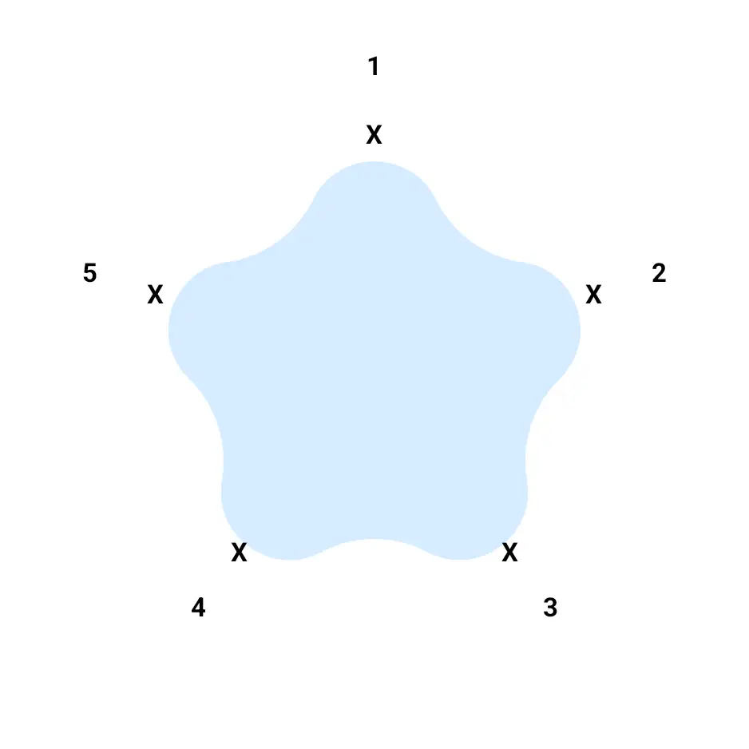

In this final part of the series, we will draw the arrows between our vertices to signify the direction and quantity of flow.

In part 3, we will be doing the following:

1. Define points for our arrows to start from and end on
2. Draw curved lines between the points

## Define Arrow Start-End Position Points

In part 2, we introduced a function called `generatePointsForIconPlacement()` to generate coordinates of icon positions. 
We modify this function to generate coordinates of points for not only icons but also where the arrows will start from and end. 
We rename it to `generatePointsForIconAndArrowPlacement()`.

We modify the function by introducing a third radius, `arrowEndRadius`, which will lie between the outer and inner radius. 
With the help of this new radius, the function will now generate two `Offsets` - one for the icons and one for the arrows. 
Therefore, we will have to modify the return type. Instead of a simple `List` of `Offset`, we return a `List` of data class 
named `IconAndArrowPositionalData` which encapsulates the two `Offsets` -


internal data class IconAndArrowPositionalData(val iconPosition: Offset, val arrowPosition: Offset)


Our new function has now been modified -


    /**
    * Generate points outside the star but in alignment with the vertices of the star.
    * the points represent where icons will be placed and
    * from where & to the arrows will start and end respectively.
    *
    * Impl of formula
    * centerX + cos(angle) * outerRadius
    *
    * to convert Polar coordinates to Cartesian coordinates
    */
    private fun generatePointsForIconAndArrowPlacement(
        numVerticesPerRadius: Int,
        outerRadius: Float,
        centerX: Float,
        centerY: Float,
    ): List<IconAndArrowPositionalData> {
            val angleStep = (Math.PI * 2) / (numVerticesPerRadius * 2)
            val placements = mutableListOf<IconAndArrowPositionalData2>()

            val arrowEndRadius = outerRadius * 0.77f

            for (i in 0 until numVerticesPerRadius * 2) {
                val angle = i * angleStep

                if (i % 2 == 0) {
                    val iconX = (centerX + cos(angle) * outerRadius).toFloat()
                    val iconY = (centerY + sin(angle) * outerRadius).toFloat()

                    val arrowX = (centerX + cos(angle) * arrowEndRadius).toFloat()
                    val arrowY = (centerY + sin(angle) * arrowEndRadius).toFloat()

                    placements.add(IconAndArrowPositionalData(Offset(iconX, iconY), Offset(arrowX, arrowY)))
                }
        }

        return placements
    }


Of course, like in all cases previously, we will have to rotate these points as well to align them with our rotated star's vertices.



    val rotatedIconAndArrowPoints = originalIconAndArrowPoints.map { iconVertex ->
        iconVertex.copy(
            iconPosition = rotatePoint(iconVertex.iconPosition, centerX, centerY),
            arrowPosition = rotatePoint(iconVertex.arrowPosition, centerX, centerY)
        )
    }



In the first image below, we can see how the blue radius highlights the boundary of our arrows. The second image highlights
the points for both arrow (marked as "X") and icon placements (numbered 1..5).

  
  

## Draw Curved Lines Between the Vertices

To draw the draw curved line, we need to learn about [Bézier curve](https://en.wikipedia.org/wiki/B%C3%A9zier_curve?useskin=vector). 
The link provides comprehensive information, but we only need to concern 
ourselves with the [Quadratic Bézier curve](https://en.wikipedia.org/wiki/B%C3%A9zier_curve?useskin=vector#Quadratic_curves), which is represented 
by the formula : 

$$
B(t) = (1 - t)^2 S + 2(1 - t)t C + t^2 E
$$

However, we don't have to worry about applying the formula since Compose provides a function that does that for us: [`quadraticTo(..)`](https://developer.android.com/reference/kotlin/androidx/compose/ui/graphics/Path#quadraticTo(kotlin.Float,kotlin.Float,kotlin.Float,kotlin.Float))

which can be applied like this - 



    val arrowPath = Path().apply {
        moveTo(start.x, start.y)
        quadraticTo(controlPoint.x, controlPoint.y, end.x, end.y)
    }

    drawPath(
        path = arrowPath,
        brush = gradientBrush,
        style = Stroke(width = lineThickness, cap = StrokeCap.Round)
    )



All we need to know are these three points (`Offsets`) -

1. Starting Point (t = 0)  
2. Ending Point (t = 1) 
3. Control Point: The point towards which our curve will gravitate to. This is the center of the star in our case. 

In part 1, we defined our Data Model for arrows, called `ArrowData` - 



    data class ArrowData(
        val fromTo: Pair<Int, Int>,
        val thickness: Float = 7f,
        val colorPair: Pair<Int, Int> = 0xFF888888.toInt() to 0xFF000000.toInt(),
    )



`fromTo` contains the index of vertices that our arrows will start from and end at respectively. 
The `Offset` of those vertices start and endpoint have been derived from our previously defined 
function - `generatePointsForIconAndArrowPlacement()`.

So, if we get `ArrowData` as a list, we can loop through it and draw all curves -



        // Draw curved arrows between the specified vertices by looping through `arrows` List

        arrows.forEach { arrow ->
            val (startIndex, endIndex) = arrow.fromTo

            val start = rotatedIconAndArrowPoints.getOrNull(startIndex)
            val end = rotatedIconAndArrowPoints.getOrNull(endIndex)

            if (start != null && end != null) {
                drawCurvedArrow(
                    start.arrowPosition,
                    end.arrowPosition,
                    arrow.thickness,
                    center,
                    listOf(Color(arrow.colorPair.first), Color(arrow.colorPair.second))
                )
            }
        }

        ...

        private fun DrawScope.drawCurvedArrow(
            start: Offset,
            end: Offset,
            lineThickness: Float,
            controlPoint: Offset,
            colors: List<Color>,
        ) {

            val arrowPath = Path().apply {
                moveTo(start.x, start.y)
                quadraticTo(controlPoint.x, controlPoint.y, end.x, end.y)
            }

            val gradientBrush = Brush.linearGradient(
                colors = colors,
                start = start,
                end = end
            )

            drawPath(
                path = arrowPath,
                brush = gradientBrush,
                style = Stroke(width = lineThickness, cap = StrokeCap.Round)
            )
            
            // Next Step
            drawClosedArrowhead(end, start, controlPoint, lineThickness, colors.last())
        }



With this, we have our curves beautifully drawn.

  

However, you will notice that they do not have the arrowheads at the end. This is because we will have to 
manually draw them. Which we will do in the next and final part.

