In the previous part, we were able to draw curved lines between two vertices of our star. The only thing missing from our
final shape is now the arrowheads at the end of the curves to signify the direction of flow.  

Drawing the arrowhead itself is straightforward; you find three points and connect them via straight lines. 
However, positioning it correctly at the end of the curve is the complicated part. Additionally, We have one more 
constraint to take into consideration. It is that the size of the arrowhead should be in proportion to the thickness of
the curve since the thickness of our curve reflects the quantity of the water flow and hence dynamic.

Therefore, we can break down our approach into three parts - 

1. Find the direction towards which the curve is heading at its end.
2. Compute the size of the arrowhead proportionally to the thickness of the curve.
3. Find the position of three points to draw the arrow head.

Step 1 and 3 are related. The three points of an arrow head can be defined as Lead Point, Base Point 1 and Base Point 2.  
Once we find the direction of the curve, we will place our leading point on some point in that direction. 
Then with the leading point calculated, we can draw the two Base Points at a certain angle and certain distance 
from the Lead Point. 

## Find the direction towards which the curve is heading at its end

The direction can be found by computing the tangent direction at the Curve's endpoint as illustrated in the image below. 

`P0` is our starting point, `P1` is the control point, and `P2` is the end point of the curve. 

<figure style="border: 2px solid #ccc; border-radius: 6px; padding: 10px; text-align: center; display: flex; flex-direction: column; align-items: center;">
    <picture>
      
    </picture>
    <figcaption>Tangent Direction of the Curve's Endpoint</figcaption>
</figure>

To find the tangent, we have to find the first differential of the Quadratic Bézier curve (since that is the type of 
curve we have drawn). This approach applies because the first derivative of any differentiable path in space gives us 
the heading direction. 

From part 3, we know that the formula that represents a Quadratic Bézier curve is  

$$
B(t) = (1 - t)^2 S + 2(1 - t)t C + t^2 E
$$

Where, `S` = `P0` = Start Point, `E` = `P2` = End Point, `C` = `P1` = Control, and `t∈[0,1]`.
`t` represents a point on the curve with its value from 0 to 1. 0 is the Start, 1 is the End.

Now, the first order derivative of a Quadratic Bézier curve is

$$
B'(t) = 2(1 - t)(C - S) + 2t(E - C)
$$

However, we are interested in finding the tangent from the End Point (E). Therefore, `t = 1`.
Which simplifies the above formula to the following 

$$
B'(t) = 2(E - C)
$$

We can ignore factor of 2 since we only care about the direction (vector). Multiplying a vector
by any positive value makes no difference to the direction.

$$
B'(t) = E - C
$$

Finally, we apply the `atan2` function on these derived coordinates to convert direction vector into rotation angle. 

`atan2(y, x)` gives the polar angle θ of (x, y) relative to the +x axis - it’s the angular part of converting 
[Cartesian to polar](https://www.mathsisfun.com/polar-cartesian-coordinates.html), without the distance `r`.

With this information in our hands, we can start writing a function to draw the closed arrowhead.



private fun DrawScope.drawClosedArrowhead(
    end: Offset,
    control: Offset,
    lineThickness: Float,
    color: Color,
) {
    val dx = (end.x - control.x)
    val dy = (end.y - control.y)
    val angle = atan2(dy, dx)
}



## Compute the size of the arrowhead proportionally to the thickness of the curve

Before we find the location of the Leading Point (`P0`) and the two Base Points (`P1` and `P2`), we need to figure out how to dynamically size 
our arrowheads. The size of the arrow can be computed from the length of the arrow `L`- the distance between Leading point 
and Base Center `B`.    

<figure style="border: 2px solid #ccc; border-radius: 6px; padding: 10px; text-align: center; display: flex; flex-direction: column; align-items: center;">
    <picture>
      
    </picture>
    <figcaption>Arrowhead with its Primary Points</figcaption>
</figure>

The larger the value of `L`, the longer distance between `P0` and `B` will be and, therefore, the bigger our arrowhead 
will become as the distance between`P1` and `P2` will increase.

To determine the length of the arrowhead `L`, it is calculated as a function of the `lineThickness` 
and a constant `lineToHeadRatio`. The value of `lineToHeadRatio` is set to 2.6, based on trial and error, 
to achieve the desired appearance.  

We can now append these findings to our function `drawClosedArrowhead()`.



private fun DrawScope.drawClosedArrowhead(
    end: Offset,
    control: Offset,
    lineThickness: Float,
    color: Color,
) {
    val dx = (end.x - control.x)
    val dy = (end.y - control.y)
    val angle = atan2(dy, dx)

    val lineToHeadRatio = 2.6f
    val arrowLength = lineThickness * lineToHeadRatio 
}



## Find the position of three points to draw the arrow head

With `arrowLength` calculated we can now start finding the three points of the arrowhead triangle. It is reasonable 
to consider the end of our curve to be the Leading Point as that is where the arrowhead needs to be. 
Therefore, `p0 = (end.x, end,y)`.

But this placement will not give us the best visual output. Because the curve is thicker than the tip of the arrowhead, 
it will protrude ahead of the Leading Point as it can be seen in the image below.

  

Therefore, we will have to move p0 a little bit forward in the direction of the curve.
This offset is determined based on the arrowhead length (`arrowLength`) and a factor of 0.5f, a value derived from trial 
and error to create a visually appealing appearance. 



val p0X = end.x + (arrowLength * 0.5f) * cos(angle)
val p0Y = end.y + (arrowLength * 0.5f) * sin(angle)



We have to convert Polar to Cartesian before we can add the offset to `end`. With this, we now have `P0`.

Next, we find `B`. We do that by moving back from `P0` by the distance of `arrowLength`/`L`.
Once we have `B`, we move 90 degrees to both directions from this `B` to a certain length. 
This certain length can be equal to `arrowLength`/`L` and later adjusted by a factor of `x` to meet your visual requirements. 
At the end of this length in each direction, we have `P1` and `P2`. 

We implement this approach in the function we have been working on (Comments added by ChatGPT).



private fun DrawScope.drawClosedArrowhead(
    end: Offset,
    control: Offset,
    lineThickness: Float,
    color: Color,
) {
    // Calculate the direction (angle) of the arrow (heading of the curve at the end point)
    val dx = end.x - control.x
    val dy = end.y - control.y
    val angle = atan2(dy, dx)

    // Length ratio for the arrowhead (this could be fine-tuned based on your preferences)
    val lineToHeadRatio = 2.6f

    // The length of the arrowhead
    val arrowLength = lineThickness * lineToHeadRatio

    // Step 1: Calculate the position of the tip (move forward along the angle from the endpoint)
    val p0X = end.x + (arrowLength * 0.5f) * cos(angle)
    val p0Y = end.y + (arrowLength * 0.5f) * sin(angle)

    // Step 2: Calculate the base center (B) by moving backwards along the heading by distance `arrowLength`
    val baseCenterX = end.x - arrowLength * cos(angle)
    val baseCenterY = end.y - arrowLength * sin(angle)

    // Step 3: Calculate the normal vector (90° left to the heading) for base corners
    val normalX = -sin(angle)
    val normalY = cos(angle)

    // Step 4: Calculate the distance between B and Base Points. 
    val arrowheadBaseWidthFactor = arrowLength * 0.8f 

    // Step 5: Calculate the two base corners (P1, P2)
    val p1X = baseCenterX + arrowheadBaseWidthFactor * normalX
    val p1Y = baseCenterY + arrowheadBaseWidthFactor * normalY
    
    val p2X = baseCenterX - arrowheadBaseWidthFactor * normalX
    val p2Y = baseCenterY - arrowheadBaseWidthFactor * normalY

    // Step 6: Create the path for the arrowhead triangle (tip -> P1 -> P2 -> tip)
    val arrowPath = Path().apply {
        moveTo(p0X, p0Y)   // Start at P0
        lineTo(p1X, p1Y)   // Draw line to P1
        lineTo(p2X, p2Y)   // Draw line to P2
        close()            // Close the triangle path
    }

    // Draw the arrowhead (triangle) on the canvas
    drawPath(
        path = arrowPath,
        color = color
    )
}



  

With this, we have achieved our objective of drawing a "Flow Graph" which represents the flow of X from point A to B.
However, there is still an issue with our rounded star drawing being depended on Compose's graphics lib.
For example, if we want to implement this same graph for iOS, we will have trouble finding an equivalent native library.

We will remove this dependency in the next post by drawing the star from scratch with some more help of Bézier Cure.    