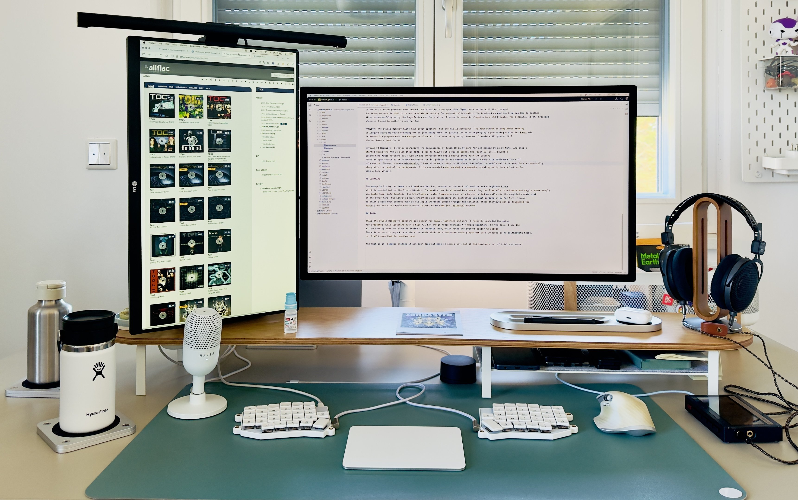
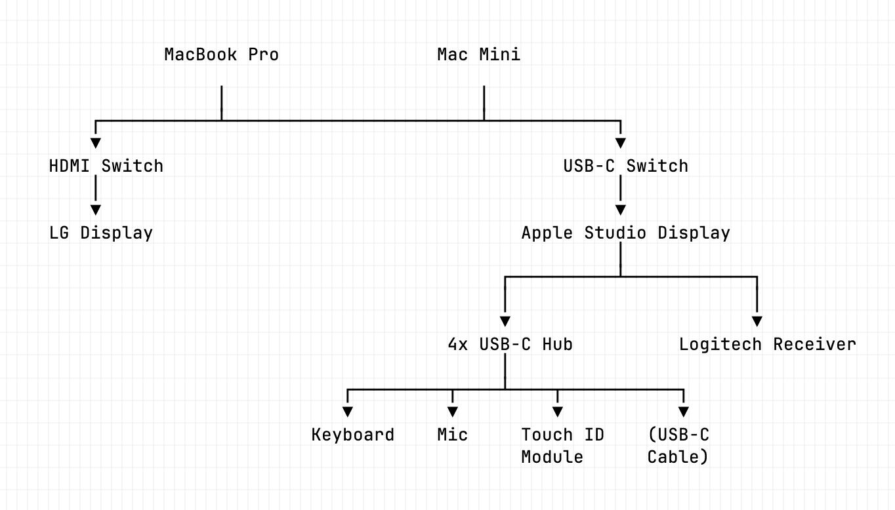
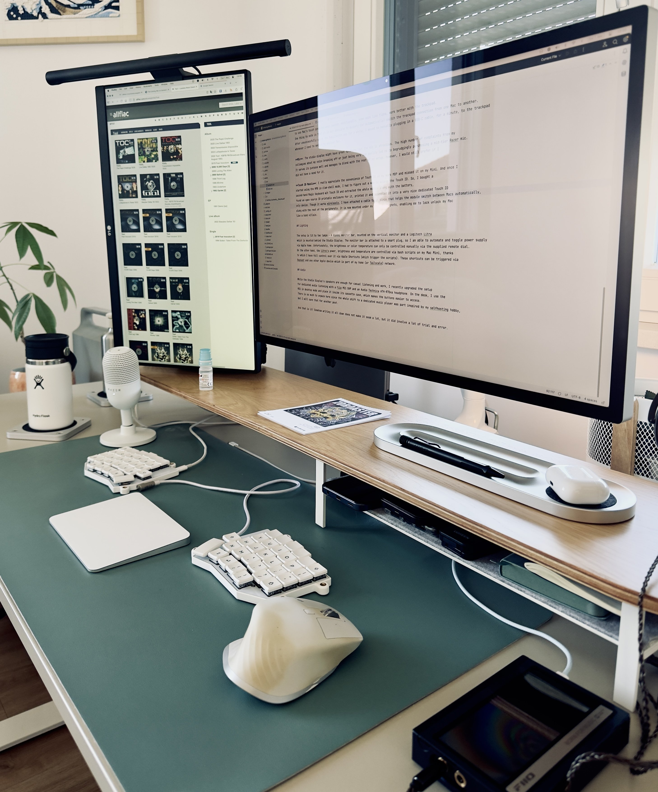
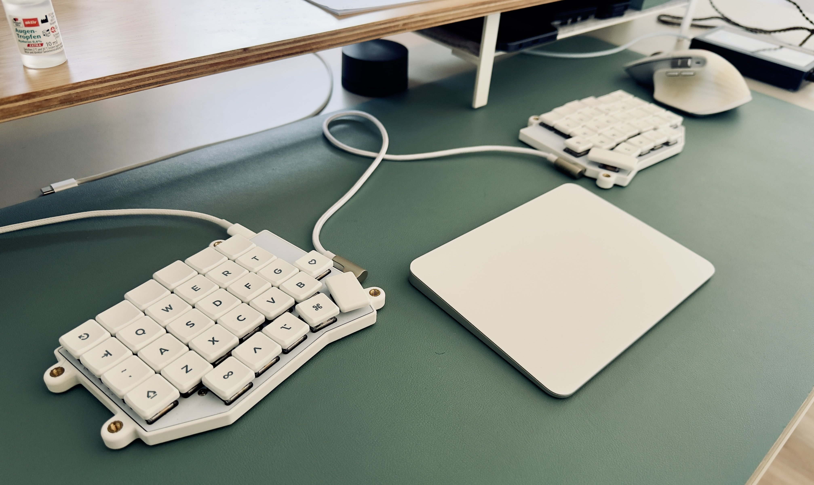
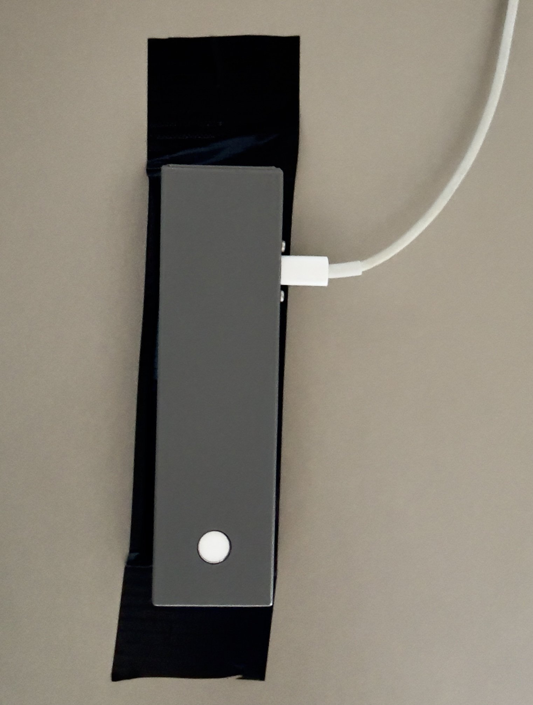
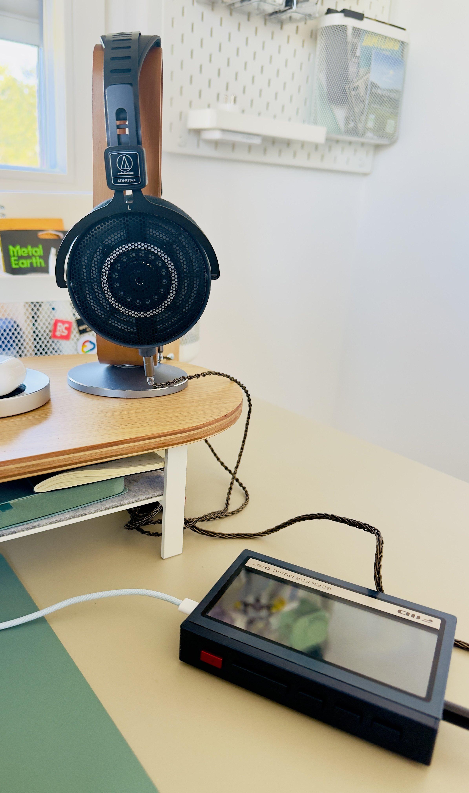
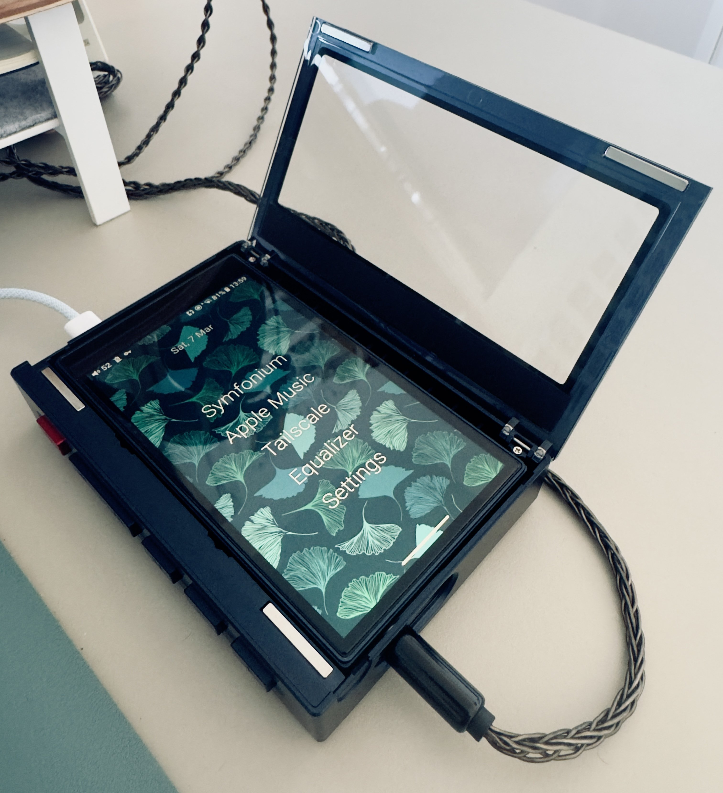

  

Tinkering with my desk setup is one of my passive hobbies on which I have spent a significant amount of time and money.
And since I have the privilege to work from home 99.9% of the time, I have, over a period of three
years, assembled a complex but very functional setup for myself. So much so that I now find the need to document
it all for my own future reference and for anyone who stumbles upon the same problems as I have and is finding a
way to solve them.

  

## Furniture

The foundation of my setup is a combination of a simple IKEA table and chair. The table has a hand crank to lift the
surface and transform it into a standing desk. Nothing fancy but it works for me. While I was very skeptical of
desk shelves, adding one to my desk provided a surprising amount of vertical space for storage and organization while
additionally, hiding clutter.

## Computers

My primary computers are two Macs - A personal M2 Mac Mini and a work assigned M3 MBP. The Mini has 24 GB of RAM but pretty
low on storage (256 GB), unfortunately. The low storage increases my dependency on external storage to keep
my documents and photos. I am working on a network attached drive as a more low cost but flexible solution.

The MBP is always docked in clam-shell mode so that I can use two external displays.

## Displays

The primary monitor is an Apple Studio Display which is complimented with a cheap 21" 1080p LG display as a vertical monitor.
The vertical configuration is great for Slack, Emails and general long form reference reading. I would love to have a
21" 4k display with better colour quality, but it seems like there are not many options in the market apart from
travel/ portable monitors.

  

The Apple Display acts like a hub to which all my peripherals and Macs are connected. With the help of a [20 Gbps USB-C
switch](https://www.cablematters.com/pc-1622-178-20gbps-usb-c-switch-for-2-computers-support-8k30hz-4k144hz-for-sharing-usb-cthunderbolt-monitors-and-docks.aspx), 
I am very easily able to switch between the Macs. This also enables the connected peripherals to automatically
start working for the Mac which has just been switched to. So, one click on my switch's remote and I can
switch from my personal workflow to work workflow. Well, almost. The vertical monitor is connected to each Mac via
an HDMI switch, which needs to be toggled with its own remote.

Another important thing to mention is the excellent audio quality of the Studio Display. I have no need to plug in a
pair of external speakers but easily rely on the display's speaker to deliver some seriously good audio. 

Note: The Cable matters switch is not a Thunderbolt switch since it supports only half of Thunderbolt 4 capacity
(20 Gbps vs 40 Gbps). It is still able to support 5k on my Studio Display while it drops to 4k for the MBP.
However, since I use 2560 x 1440 resolution and not full 5k, the visual experience remains the same for my use cases.

## Peripherals

  

**Keyboard**: I recently switched to a split keyboard after using Logitech MX Keys for a couple of years. 
The new keyboard of my choice is a [Sofle Choc Pro by Keebart](https://www.keebart.com/products/sofle). It took me about
a week or so to get used to the split layout, but now I love the fact that my shoulders do not round inwards anymore, resulting 
in an improved posture. Plus, mechanical keyboard is such a pleasure to type on.

**Mouse**: I have been an MX Master user for about a decade now and currently use a 3S. I like the device in terms of 
functionality, but the material around the grip area is of poor quality and has yellowed over a short period of time. 
Additionally, the Logitech software is horrible. I don't think my next mouse will be a Logitech.

**Trackpad**: This is my secondary pointing device. While not as ergonomic as a mouse, the touchpad makes it easy 
to use Mac's touch gestures when needed. Additionally, some apps like figma, work better with the trackpad. 
One thing to note is that it is not possible to quickly (or automatically) switch the trackpad connection from one Mac to another. 
After unsuccessfully using the MagicSwitch app for a while, I moved to manually plugging in a USB-C cable, for a minute, to the trackpad 
whenever I need to switch to another Mac.

**Mic**: The studio display might have great speakers, but the mic is atrocious. The high number of complaints from my
colleagues about my voice breaking off or just being very low quality led me to begrudgingly purchasing a mid-tier Razer mic. 
It serves its purpose well and manages to blend with the rest of my setup. However, I would still prefer if I 
did not have a need for it.

**Touch ID Module**: I really appreciate the convenience of Touch ID on my work MBP and missed it on my Mini. And once I 
started using the MPB in clam-shell mode, I had to figure out a way to access the Touch ID. So, I bought a 
second-hand Magic Keyboard wit Touch ID and extracted the whole module along with the battery, 
found an open source 3D printable enclosure for it, printed it and assembled it into a very nice dedicated Touch ID 
only device. Though it works wirelessly, I have attached a cable to it since that helps the module switch between Macs automatically, 
along with the rest of the peripherals. It is now mounted under my desk via magnets, enabling me to lock unlock my Mac 
like a bond villain. 

  

## Lighting

The setup is lit by two lamps - A Xiaomi monitor bar, mounted on the vertical monitor and a Logitech Litra 
which is mounted behind the Studio Display. The monitor bar is attached to a smart plug, so I am able to automate and toggle power supply
via Apple Home. Unfortunately, the brightness or color temperature can only be controlled manually via the supplied remote dial. 
On the other hand, the Litra's power, brightness and temperature are controlled via bash scripts on my Mac Mini, thanks 
to which I have full control over it via Apple Shortcuts (which trigger the scripts). These shortcuts can be triggered via 
Raycast and any other Apple device which is part of my home (or Tailscale) network.

## Audio

While the Studio Display's speakers are enough for casual listening and work, I recently upgraded the setup 
for dedicated audio listening with a Fiio M21 DAP and an Audio Technica ATH-R70xa headphone. On the desk, I use the 
M21 in desktop mode and place it inside its cassette case, which makes the buttons easier to access. 
There is so much to unpack here since the whole shift to a dedicated music player was part inspired by my selfhosting hobby, 
but I will save that for another post.

  

  

And that is it! Somehow writing it all down does not make it seem a lot, but it did involve a lot of trial & error 
and money. 
